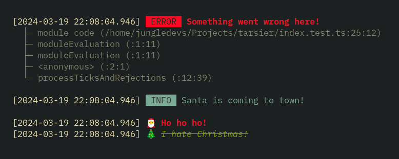

<div align="center">
  <h1>🌒 Tarsier</h1>
  <strong>Yet another logging library for Node.js/Bun</strong>
  
  <br>
  <b>W.I.P.</b>
</div>

---

Tarsier is intended to be fast, highly customizable and just pretty.

If you need a more complex JSON logger, you should check out [pino](https://github.com/pinojs/pino) instead.

Tarsier was highly inspired by [Signale](https://github.com/klaudiosinani/signale), which still might be a better option for you.

## Installing

```sh
npm i -D tarsierjs
yarn add -D tarsierjs
pnpm add -D tarsierjs
bun add -D tarsierjs
```

## Usage

```ts
import { tarsier, Color } from ".";

const logger = tarsier({
  types: {
    santa: {
      level: "info",
      prefix: "🎅",
      color: {
        foreground: Color.Foreground.Red,
        style: Color.Style.Bold,
      },
    },
    grinch: {
      level: "warn",
      prefix: "🎄",
      color: {
        foreground: Color.Foreground.Green,
        style: [Color.Style.Strikethrough, Color.Style.Italic],
      },
    },
  },
});

logger.error(new Error("Something went wrong here!"));
logger.info("Santa is coming to town!");
logger.santa("Ho ho ho!");
logger.grinch("I hate Christmas!");
```
